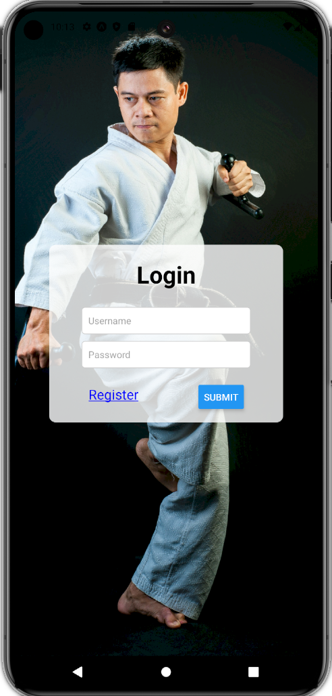
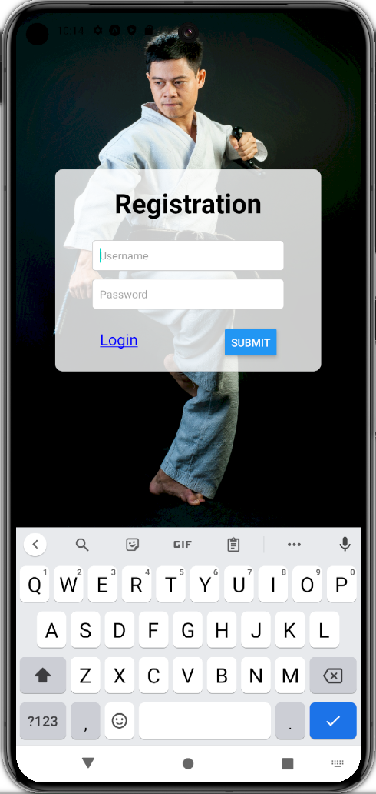

# React Native Practice

**Objective:**

- Begin building a Login screen, Profile screen, and Data screen `React Native`
- Ability to create an account and login
- Complete learning goals

**Learning Goal(s):**

- Learn navigation / linking screen
- Continue practice with using React Native

### Mobile App Preview

&nbsp;

Figure 1 & 2: Development screenshots of React Native App on Pixel 8 Pro

